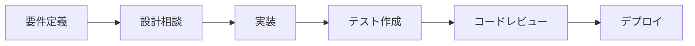

# Claude Code Engineering Guide
## 最高品質のソフトウェア開発を実現するための完全ガイド

---

## 🎯 このガイドの目的

Claude Codeを使用して、効率的かつ高品質なソフトウェア開発を実現するための包括的なガイドラインです。このガイドに従うことで、Claude Codeの能力を最大限に引き出し、プロフェッショナルレベルの開発を行うことができます。

---

## 📋 目次

1. [プロジェクト概要](#プロジェクト概要)
2. [Claude Codeの効果的な使い方](#claude-codeの効果的な使い方)
3. [プロンプトエンジニアリング](#プロンプトエンジニアリング)
4. [開発ワークフロー](#開発ワークフロー)
5. [コーディング規約](#コーディング規約)
6. [セキュリティガイドライン](#セキュリティガイドライン)
7. [テスト戦略](#テスト戦略)
8. [トラブルシューティング](#トラブルシューティング)
9. [ベストプラクティス集](#ベストプラクティス集)

---

## 🚀 プロジェクト概要

### プロジェクト情報
- **プロジェクト名**: [プロジェクト名を記載]
- **目的**: [プロジェクトの目的を記載]
- **主要技術スタック**: 
  - Frontend: React + TypeScript + Tailwind CSS
  - Backend: Node.js/Spring Boot
  - Database: PostgreSQL
  - Infrastructure: Docker + Kubernetes

### ディレクトリ構造
```
project-root/
├── src/                    # ソースコード
│   ├── frontend/          # フロントエンドコード
│   ├── backend/           # バックエンドコード
│   └── shared/            # 共有コード
├── tests/                 # テストコード
├── docs/                  # ドキュメント
├── scripts/               # ビルド・デプロイスクリプト
├── .github/               # GitHub Actions設定
├── CLAUDE.md             # このファイル
└── README.md             # プロジェクト説明
```

---

## 🤖 Claude Codeの効果的な使い方

### 1. 明確な指示の与え方

#### ✅ 良い例
```
「UserServiceクラスにユーザー検索機能を追加してください。
- メールアドレスで検索
- 部分一致検索対応
- ページネーション実装（1ページ20件）
- 適切なエラーハンドリング
- テストコード付き」
```

#### ❌ 悪い例
```
「ユーザー検索を作って」
```

### 2. コンテキストの共有

#### プロジェクト固有情報の記載
```markdown
## プロジェクトコンテキスト
- 認証方式: JWT (HS512)
- DBアクセス: Prisma ORM使用
- APIバージョニング: /api/v1/
- エラーレスポンス: 統一フォーマット使用
- ロギング: Winston使用
```

### 3. 段階的な実装依頼

大きなタスクは小さく分割して依頼する：

1. **設計フェーズ**: 「この機能の設計を提案してください」
2. **実装フェーズ**: 「設計に基づいて実装してください」
3. **テストフェーズ**: 「単体テストを追加してください」
4. **リファクタリング**: 「コードを最適化してください」

### 4. フィードバックループ

```markdown
## Claude Codeとの対話例
User: 「ログイン機能を実装してください」
Claude: [実装]
User: 「パスワードの暗号化を追加してください」
Claude: [修正]
User: 「ブルートフォース対策も追加してください」
Claude: [追加実装]
```

---

## 💡 プロンプトエンジニアリング

### 効果的なプロンプトの構造

```markdown
## タスク: [明確なタスク名]

### 背景
[なぜこの機能が必要か]

### 要件
- [ ] 要件1
- [ ] 要件2
- [ ] 要件3

### 制約条件
- 使用技術: [指定技術]
- パフォーマンス: [目標値]
- セキュリティ: [要件]

### 期待する成果物
1. ソースコード
2. テストコード
3. ドキュメント更新
```

### プロンプトテンプレート集

#### 機能実装テンプレート
```
「[機能名]を実装してください。

要件:
- [具体的な要件1]
- [具体的な要件2]

技術仕様:
- 言語: TypeScript
- フレームワーク: React
- スタイリング: Tailwind CSS

以下を含めてください:
- エラーハンドリング
- ローディング状態
- アクセシビリティ対応
- 型定義」
```

#### バグ修正テンプレート
```
「以下のバグを修正してください。

現象:
[バグの具体的な現象]

再現手順:
1. [手順1]
2. [手順2]

期待する動作:
[正しい動作]

関連ファイル:
- [ファイルパス1]
- [ファイルパス2]」
```

#### リファクタリングテンプレート
```
「[対象コード]をリファクタリングしてください。

改善点:
- [ ] 可読性向上
- [ ] パフォーマンス改善
- [ ] 重複コード削除
- [ ] 型安全性強化

制約:
- 既存の公開APIは変更しない
- テストが通ること」
```

---

## 🔄 開発ワークフロー

### 1. 新機能開発フロー



#### 各ステップでのClaude Code活用法

**要件定義**
```
「以下の要件を技術仕様に落とし込んでください
- ユーザーストーリー: [内容]
- 受け入れ条件: [条件]」
```

**設計相談**
```
「この機能の設計を提案してください
- アーキテクチャ図
- クラス図
- シーケンス図」
```

**実装**
```
「設計に基づいて実装してください
- 設計書: [参照]
- コーディング規約準拠
- エラーハンドリング完備」
```

### 2. デバッグワークフロー

1. **エラー分析**
   ```
   「このエラーを分析してください
   エラーメッセージ: [エラー内容]
   発生箇所: [ファイル:行番号]」
   ```

2. **原因特定**
   ```
   「考えられる原因をリストアップして、
   調査方法を提案してください」
   ```

3. **修正実施**
   ```
   「特定した原因を修正してください
   テストケースも追加でお願いします」
   ```

### 3. コードレビューワークフロー

```
「以下のコードをレビューしてください

チェックポイント:
- [ ] セキュリティ脆弱性
- [ ] パフォーマンス問題
- [ ] コーディング規約違反
- [ ] 潜在的なバグ
- [ ] テストカバレッジ

[コード内容]」
```

---

## 📐 コーディング規約

### TypeScript/JavaScript

```typescript
// ✅ 良い例
interface UserData {
  id: string;
  name: string;
  email: string;
  createdAt: Date;
}

export const createUser = async (data: Omit<UserData, 'id' | 'createdAt'>): Promise<UserData> => {
  try {
    const user = await db.user.create({
      data: {
        ...data,
        id: generateUuid(),
        createdAt: new Date()
      }
    });
    return user;
  } catch (error) {
    logger.error('Failed to create user', { error, data });
    throw new UserCreationError('ユーザーの作成に失敗しました');
  }
};

// ❌ 悪い例
export const createUser = async (data: any) => {
  const user = await db.user.create({ data });
  return user;
};
```

### React コンポーネント

```typescript
// ✅ 良い例
interface ButtonProps {
  children: React.ReactNode;
  onClick: () => void;
  variant?: 'primary' | 'secondary';
  disabled?: boolean;
  loading?: boolean;
}

export const Button: React.FC<ButtonProps> = ({
  children,
  onClick,
  variant = 'primary',
  disabled = false,
  loading = false
}) => {
  const handleClick = useCallback(() => {
    if (!disabled && !loading) {
      onClick();
    }
  }, [disabled, loading, onClick]);

  return (
    <button
      className={cn(
        'px-4 py-2 rounded-lg font-medium transition-colors',
        {
          'bg-blue-600 text-white hover:bg-blue-700': variant === 'primary',
          'bg-gray-200 text-gray-800 hover:bg-gray-300': variant === 'secondary',
          'opacity-50 cursor-not-allowed': disabled || loading
        }
      )}
      onClick={handleClick}
      disabled={disabled || loading}
      aria-busy={loading}
    >
      {loading ? <Spinner /> : children}
    </button>
  );
};
```

### エラーハンドリング

```typescript
// ✅ 包括的なエラーハンドリング
class APIError extends Error {
  constructor(
    message: string,
    public statusCode: number,
    public code: string,
    public details?: unknown
  ) {
    super(message);
    this.name = 'APIError';
  }
}

export const apiCall = async <T>(
  method: string,
  endpoint: string,
  data?: unknown
): Promise<T> => {
  try {
    const response = await fetch(endpoint, {
      method,
      headers: {
        'Content-Type': 'application/json',
        'Authorization': `Bearer ${getToken()}`
      },
      body: data ? JSON.stringify(data) : undefined
    });

    if (!response.ok) {
      const error = await response.json();
      throw new APIError(
        error.message || 'API call failed',
        response.status,
        error.code || 'UNKNOWN_ERROR',
        error.details
      );
    }

    return response.json();
  } catch (error) {
    if (error instanceof APIError) {
      throw error;
    }
    
    logger.error('Unexpected error in API call', { error, method, endpoint });
    throw new APIError(
      'ネットワークエラーが発生しました',
      0,
      'NETWORK_ERROR'
    );
  }
};
```

---

## 🔒 セキュリティガイドライン

### 必須セキュリティ対策

#### 1. 認証・認可
```typescript
// JWT検証ミドルウェア
export const authenticateToken = async (req: Request, res: Response, next: NextFunction) => {
  const token = req.headers.authorization?.split(' ')[1];
  
  if (!token) {
    return res.status(401).json({ error: '認証が必要です' });
  }

  try {
    const payload = jwt.verify(token, process.env.JWT_SECRET!) as JWTPayload;
    
    // トークンの有効期限チェック
    if (Date.now() >= payload.exp * 1000) {
      return res.status(401).json({ error: 'トークンの有効期限が切れています' });
    }
    
    // ユーザー情報をリクエストに追加
    req.user = await getUserById(payload.userId);
    next();
  } catch (error) {
    logger.warn('Invalid token attempt', { token: token.substring(0, 10) + '...', error });
    return res.status(403).json({ error: '無効なトークンです' });
  }
};
```

#### 2. 入力検証
```typescript
// Zodを使用した入力検証
import { z } from 'zod';

const createUserSchema = z.object({
  email: z.string().email('有効なメールアドレスを入力してください'),
  password: z.string()
    .min(8, 'パスワードは8文字以上必要です')
    .regex(/[A-Z]/, '大文字を1文字以上含めてください')
    .regex(/[a-z]/, '小文字を1文字以上含めてください')
    .regex(/[0-9]/, '数字を1文字以上含めてください')
    .regex(/[^A-Za-z0-9]/, '特殊文字を1文字以上含めてください'),
  name: z.string()
    .min(1, '名前は必須です')
    .max(100, '名前は100文字以内で入力してください')
});

export const validateCreateUser = (data: unknown) => {
  return createUserSchema.parse(data);
};
```

#### 3. SQLインジェクション対策
```typescript
// ✅ パラメータ化クエリ（安全）
const getUser = async (userId: string) => {
  return await db.query(
    'SELECT * FROM users WHERE id = $1',
    [userId]
  );
};

// ❌ 文字列結合（危険）
const getUser = async (userId: string) => {
  return await db.query(
    `SELECT * FROM users WHERE id = '${userId}'`
  );
};
```

#### 4. XSS対策
```typescript
// React（自動エスケープ）
const UserProfile = ({ user }: { user: User }) => {
  return (
    <div>
      <h1>{user.name}</h1>
      <p>{user.bio}</p>
    </div>
  );
};

// 危険なHTML挿入が必要な場合
import DOMPurify from 'dompurify';

const RichTextDisplay = ({ html }: { html: string }) => {
  const sanitizedHtml = DOMPurify.sanitize(html, {
    ALLOWED_TAGS: ['p', 'br', 'strong', 'em', 'u', 'a'],
    ALLOWED_ATTR: ['href', 'target']
  });

  return (
    <div dangerouslySetInnerHTML={{ __html: sanitizedHtml }} />
  );
};
```

### セキュリティチェックリスト

- [ ] すべての入力値を検証・サニタイズ
- [ ] 認証・認可の実装
- [ ] HTTPS通信の強制
- [ ] セキュリティヘッダーの設定
- [ ] 定期的な依存関係の更新
- [ ] エラーメッセージに機密情報を含めない
- [ ] ログに個人情報を記録しない
- [ ] Rate Limitingの実装
- [ ] CORS設定の適切な設定

---

## 🧪 テスト戦略

### テストピラミッド

```
        E2E Tests (10%)
       /            \
    Integration (30%)
   /                \
Unit Tests (60%)
```

### 単体テスト例

```typescript
// user.service.test.ts
describe('UserService', () => {
  let userService: UserService;
  let mockUserRepository: jest.Mocked<UserRepository>;

  beforeEach(() => {
    mockUserRepository = createMockUserRepository();
    userService = new UserService(mockUserRepository);
  });

  describe('createUser', () => {
    it('正常にユーザーを作成できること', async () => {
      // Arrange
      const userData = {
        email: 'test@example.com',
        name: 'Test User',
        password: 'SecurePass123!'
      };
      const expectedUser = {
        id: 'user-123',
        ...userData,
        password: 'hashed-password',
        createdAt: new Date()
      };
      mockUserRepository.create.mockResolvedValue(expectedUser);

      // Act
      const result = await userService.createUser(userData);

      // Assert
      expect(result).toEqual(expectedUser);
      expect(mockUserRepository.create).toHaveBeenCalledWith({
        ...userData,
        password: expect.stringContaining('$2b$')
      });
    });

    it('メールアドレスが既に存在する場合エラーを投げること', async () => {
      // Arrange
      const userData = {
        email: 'existing@example.com',
        name: 'Test User',
        password: 'SecurePass123!'
      };
      mockUserRepository.findByEmail.mockResolvedValue({ id: 'existing-user' } as User);

      // Act & Assert
      await expect(userService.createUser(userData))
        .rejects
        .toThrow('このメールアドレスは既に使用されています');
    });
  });
});
```

### 統合テスト例

```typescript
// api.integration.test.ts
describe('User API Integration Tests', () => {
  let app: Application;
  let authToken: string;

  beforeAll(async () => {
    app = await createTestApp();
    authToken = await getTestAuthToken();
  });

  afterAll(async () => {
    await closeTestApp();
  });

  describe('POST /api/v1/users', () => {
    it('新規ユーザーを作成できること', async () => {
      const response = await request(app)
        .post('/api/v1/users')
        .set('Authorization', `Bearer ${authToken}`)
        .send({
          email: 'newuser@example.com',
          name: 'New User',
          password: 'SecurePass123!'
        });

      expect(response.status).toBe(201);
      expect(response.body).toMatchObject({
        id: expect.any(String),
        email: 'newuser@example.com',
        name: 'New User'
      });
      expect(response.body.password).toBeUndefined();
    });

    it('不正なデータでエラーを返すこと', async () => {
      const response = await request(app)
        .post('/api/v1/users')
        .set('Authorization', `Bearer ${authToken}`)
        .send({
          email: 'invalid-email',
          name: '',
          password: '123'
        });

      expect(response.status).toBe(400);
      expect(response.body.errors).toContainEqual(
        expect.objectContaining({
          field: 'email',
          message: '有効なメールアドレスを入力してください'
        })
      );
    });
  });
});
```

### E2Eテスト例

```typescript
// user-registration.e2e.test.ts
describe('User Registration Flow', () => {
  beforeEach(async () => {
    await page.goto('http://localhost:3000/register');
  });

  it('正常にユーザー登録ができること', async () => {
    // フォーム入力
    await page.fill('[data-testid="email-input"]', 'e2e-test@example.com');
    await page.fill('[data-testid="name-input"]', 'E2E Test User');
    await page.fill('[data-testid="password-input"]', 'SecurePass123!');
    await page.fill('[data-testid="password-confirm-input"]', 'SecurePass123!');

    // 利用規約に同意
    await page.check('[data-testid="terms-checkbox"]');

    // 送信
    await page.click('[data-testid="submit-button"]');

    // 成功メッセージの確認
    await expect(page.locator('[data-testid="success-message"]')).toBeVisible();
    await expect(page.locator('[data-testid="success-message"]')).toContainText('登録が完了しました');

    // ダッシュボードへのリダイレクト確認
    await page.waitForURL('http://localhost:3000/dashboard');
  });

  it('パスワードが一致しない場合エラーを表示すること', async () => {
    await page.fill('[data-testid="password-input"]', 'SecurePass123!');
    await page.fill('[data-testid="password-confirm-input"]', 'DifferentPass123!');

    await page.click('[data-testid="submit-button"]');

    await expect(page.locator('[data-testid="error-message"]')).toBeVisible();
    await expect(page.locator('[data-testid="error-message"]')).toContainText('パスワードが一致しません');
  });
});
```

---

## 🔧 トラブルシューティング

### よくある問題と解決方法

#### 1. Claude Codeが期待通りに動作しない

**問題**: 指示した内容と異なる実装をする

**解決方法**:
```markdown
1. より具体的な指示を与える
   ❌ 「ログイン機能を作って」
   ✅ 「JWT認証を使用したログイン機能を実装してください。
       - メールとパスワードで認証
       - bcryptでパスワードハッシュ化
       - リフレッシュトークン対応
       - Rate Limiting実装」

2. 参考コードを提示する
   「既存のUserServiceを参考に、同じパターンでAuthServiceを実装してください」

3. 段階的に依頼する
   Step 1: 「まずAPIのインターフェースを定義してください」
   Step 2: 「次に実装を追加してください」
   Step 3: 「最後にテストを書いてください」
```

#### 2. コードの品質が低い

**問題**: 生成されたコードにバグが多い、エラーハンドリングが不十分

**解決方法**:
```markdown
必ず以下を指示に含める:
- 「エラーハンドリングを完備してください」
- 「TypeScriptの型を厳密に定義してください」
- 「適切なログ出力を追加してください」
- 「セキュリティを考慮してください」
- 「パフォーマンスを最適化してください」
```

#### 3. 大規模な変更で混乱する

**問題**: 複数ファイルにまたがる変更で整合性が取れない

**解決方法**:
```markdown
1. 影響範囲を明確にする
   「この変更により影響を受けるファイルをリストアップしてください」

2. 変更計画を作成する
   「実装前に、必要な変更の計画を作成してください」

3. 一つずつ確認しながら進める
   「まずEntityの変更から始めてください」
   「次にServiceを更新してください」
   「最後にControllerを修正してください」
```

### デバッグTips

#### 1. エラーメッセージの活用
```
「以下のエラーが発生しています。原因と解決方法を教えてください。

エラーメッセージ:
[エラー内容をペースト]

発生箇所:
[ファイル名:行番号]

実行していた処理:
[何をしようとしていたか]」
```

#### 2. ログの追加
```typescript
// デバッグ用の詳細ログ
logger.debug('Processing user registration', {
  email: userData.email,
  timestamp: new Date().toISOString(),
  requestId: req.id
});

try {
  const user = await userService.createUser(userData);
  logger.info('User created successfully', { userId: user.id });
} catch (error) {
  logger.error('Failed to create user', {
    error: error.message,
    stack: error.stack,
    userData: { email: userData.email } // パスワードは記録しない
  });
}
```

#### 3. 単体テストでの問題特定
```
「この関数の単体テストを書いて、すべてのエッジケースをカバーしてください」

これにより、問題のある箇所を特定しやすくなります。
```

---

## 🌟 ベストプラクティス集

### 1. コミットメッセージ

```bash
# 良い例
feat: ユーザー認証機能を追加
- JWT認証の実装
- リフレッシュトークン対応
- Rate Limiting追加

fix: ログイン時のエラーハンドリングを修正
- 不正なメールアドレス形式でのエラーメッセージ改善
- パスワード検証ロジックの修正

docs: API仕様書を更新
- 認証エンドポイントの追加
- エラーレスポンス形式の文書化

# 悪い例
update code
fix bug
WIP
```

### 2. Pull Request作成

```markdown
## 概要
ユーザー認証機能を実装しました。

## 変更内容
- JWT認証の実装
- ログイン/ログアウトAPI
- 認証ミドルウェア
- リフレッシュトークン機能

## テスト
- [x] 単体テスト追加
- [x] 統合テスト追加
- [x] 手動テスト完了

## チェックリスト
- [x] コードレビュー依頼前にセルフレビュー実施
- [x] テストがすべて成功
- [x] ドキュメント更新
- [x] 破壊的変更なし

## スクリーンショット
[必要に応じて添付]

## 関連Issue
Closes #123
```

### 3. ドキュメント作成

```markdown
# ユーザー認証API

## 概要
JWT認証を使用したユーザー認証機能を提供します。

## エンドポイント

### POST /api/v1/auth/login
ユーザーログイン

**リクエスト**
```json
{
  "email": "user@example.com",
  "password": "SecurePass123!"
}
```

**レスポンス（成功）**
```json
{
  "accessToken": "eyJ...",
  "refreshToken": "eyJ...",
  "user": {
    "id": "user-123",
    "email": "user@example.com",
    "name": "User Name"
  }
}
```

**エラーレスポンス**
```json
{
  "error": {
    "code": "INVALID_CREDENTIALS",
    "message": "メールアドレスまたはパスワードが正しくありません"
  }
}
```

## 認証フロー
1. `/api/v1/auth/login`でログイン
2. レスポンスのaccessTokenをAuthorizationヘッダーに設定
3. `Authorization: Bearer {accessToken}`形式で送信
4. トークン期限切れ時は`/api/v1/auth/refresh`でリフレッシュ

## セキュリティ考慮事項
- パスワードはbcryptでハッシュ化
- JWTの有効期限は15分
- リフレッシュトークンは7日間有効
- 5回連続ログイン失敗で一時的にアカウントロック
```

### 4. コードの整理

```typescript
// ✅ 関心の分離
// user.controller.ts - HTTPリクエスト/レスポンス処理
export class UserController {
  constructor(private userService: UserService) {}

  async createUser(req: Request, res: Response) {
    try {
      const userData = validateCreateUser(req.body);
      const user = await this.userService.createUser(userData);
      res.status(201).json(user);
    } catch (error) {
      handleError(error, res);
    }
  }
}

// user.service.ts - ビジネスロジック
export class UserService {
  constructor(private userRepository: UserRepository) {}

  async createUser(data: CreateUserData): Promise<User> {
    // ビジネスロジック
    const existingUser = await this.userRepository.findByEmail(data.email);
    if (existingUser) {
      throw new BusinessError('このメールアドレスは既に使用されています');
    }

    const hashedPassword = await bcrypt.hash(data.password, 10);
    return this.userRepository.create({
      ...data,
      password: hashedPassword
    });
  }
}

// user.repository.ts - データアクセス
export class UserRepository {
  async create(data: CreateUserData): Promise<User> {
    return await db.user.create({ data });
  }

  async findByEmail(email: string): Promise<User | null> {
    return await db.user.findUnique({ where: { email } });
  }
}
```

### 5. パフォーマンス最適化

```typescript
// ✅ 効率的なデータ取得
// N+1問題の回避
const getUsersWithPosts = async () => {
  return await db.user.findMany({
    include: {
      posts: {
        orderBy: { createdAt: 'desc' },
        take: 5
      }
    }
  });
};

// キャッシュの活用
import { Redis } from 'ioredis';
const redis = new Redis();

const getCachedUser = async (userId: string): Promise<User | null> => {
  const cacheKey = `user:${userId}`;
  const cached = await redis.get(cacheKey);
  
  if (cached) {
    return JSON.parse(cached);
  }

  const user = await db.user.findUnique({ where: { id: userId } });
  if (user) {
    await redis.set(cacheKey, JSON.stringify(user), 'EX', 3600); // 1時間キャッシュ
  }
  
  return user;
};

// バッチ処理
const updateMultipleUsers = async (updates: UserUpdate[]) => {
  const chunks = chunk(updates, 100); // 100件ずつ処理
  
  for (const chunk of chunks) {
    await db.$transaction(
      chunk.map(update => 
        db.user.update({
          where: { id: update.id },
          data: update.data
        })
      )
    );
  }
};
```

---

## 📚 参考リソース

### 公式ドキュメント
- [Claude Code Documentation](https://docs.anthropic.com/claude-code)
- [TypeScript Handbook](https://www.typescriptlang.org/docs/)
- [React Documentation](https://react.dev/)
- [Node.js Best Practices](https://github.com/goldbergyoni/nodebestpractices)

### 推奨ツール
- **開発環境**: VS Code + Claude Code Extension
- **デバッグ**: Chrome DevTools, VS Code Debugger
- **テスト**: Jest, Cypress, Playwright
- **品質管理**: ESLint, Prettier, Husky
- **モニタリング**: Sentry, DataDog, New Relic

### セキュリティリソース
- [OWASP Top 10](https://owasp.org/www-project-top-ten/)
- [Node.js Security Checklist](https://blog.risingstack.com/node-js-security-checklist/)
- [JWT Best Practices](https://tools.ietf.org/html/rfc8725)

---

## 🎯 まとめ

このガイドラインに従うことで、Claude Codeを最大限に活用し、高品質なソフトウェア開発を実現できます。重要なポイント：

1. **明確な指示**: 具体的で詳細な指示を与える
2. **段階的アプローチ**: 大きなタスクは小さく分割
3. **品質重視**: テスト、セキュリティ、パフォーマンスを常に考慮
4. **継続的改善**: フィードバックを活かして改善

Claude Codeは強力なツールですが、適切な使い方をすることでその真価を発揮します。このガイドを参考に、効率的で高品質な開発を実現してください。

---

**最終更新日**: 2025-07-14
**バージョン**: 1.0.0