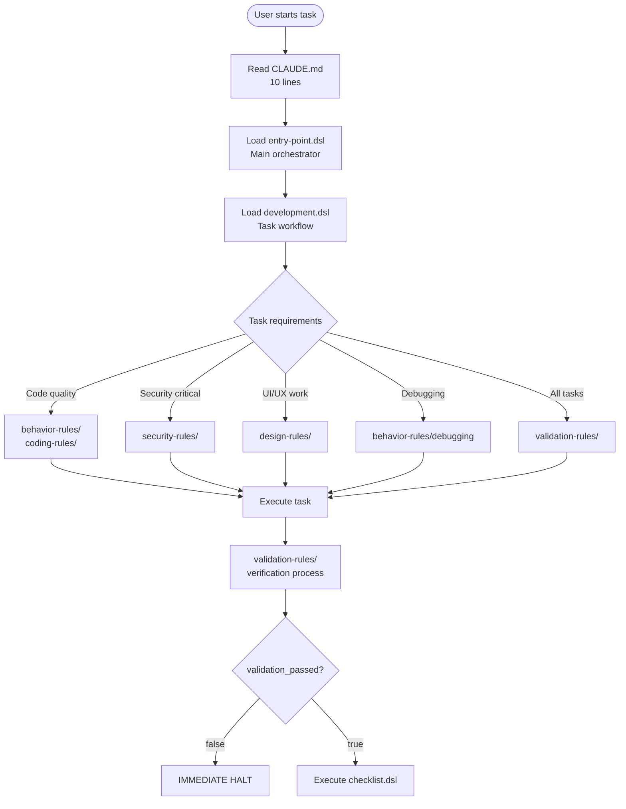
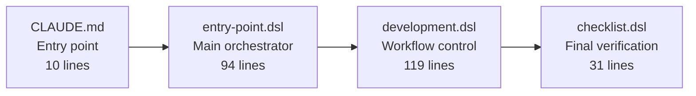
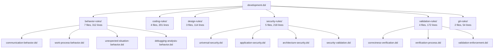
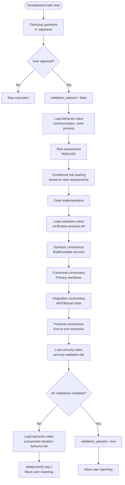
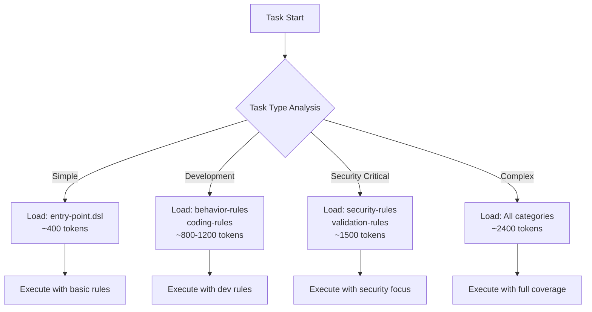
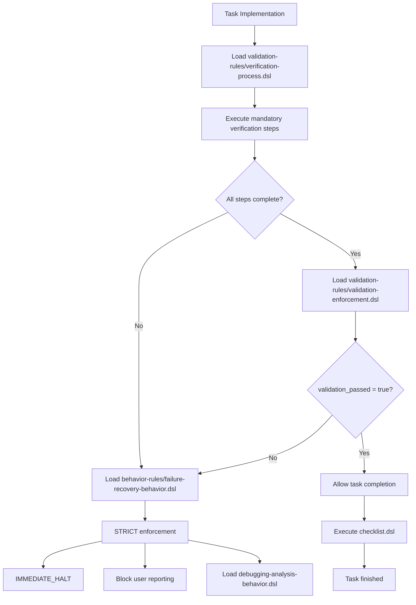
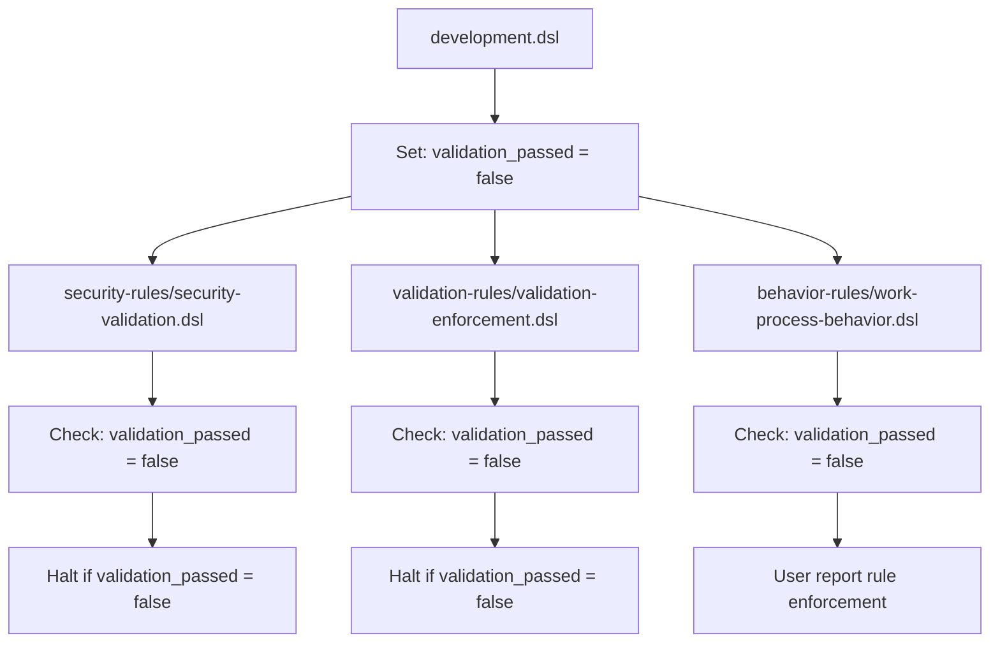
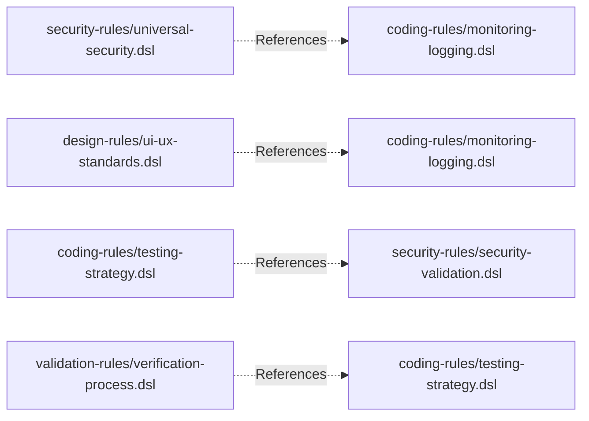
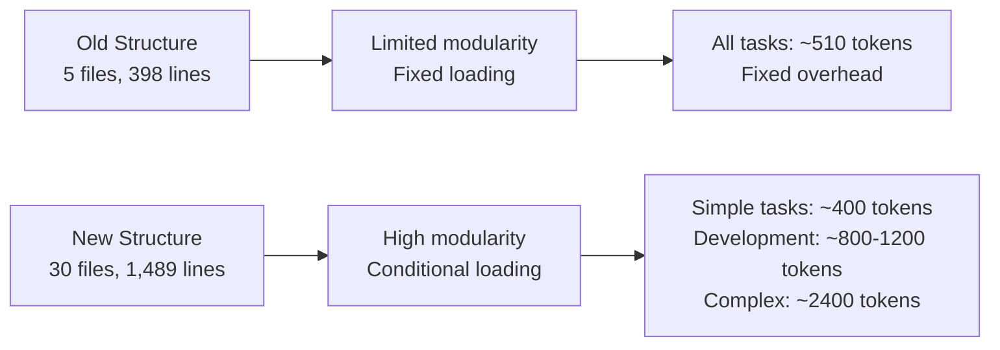

# Claude DSL Processing Flow

## 1. Overall System Architecture

### Current Modular Structure


## 2. File Structure Overview

### Core System (Always Loaded)


### Modular Rule Categories (Conditional Loading)


## 3. Development Task Detailed Flow



## 4. Conditional Loading Logic

### Task-Based Loading Strategy


### Loading Conditions in development.dsl
```yaml
# Conditional loading based on requirements
flow:
  - action: load_external
    files:
      - "behavior-rules/index.dsl"
  
  - action: load_on_demand
    condition: "requires_code_quality"
    files:
      - "coding-rules/index.dsl"
  
  - action: load_on_demand
    condition: "requires_security_focus"
    files:
      - "security-rules/index.dsl"
  
  - action: load_on_demand
    condition: "requires_ui_work"
    files:
      - "design-rules/index.dsl"
```

## 5. Validation Enforcement Flow



## 6. Cross-Module References

### Unified Variable System


### Cross-Reference Network


## 7. Token Efficiency Analysis

### Current Structure Benefits


### Loading Efficiency
| Strategy | Files Loaded | Estimated Tokens | Use Case |
|----------|--------------|------------------|----------|
| **Minimal** | entry-point.dsl only | ~400 tokens | Simple tasks |
| **Conditional** | Based on task type | ~800-1,200 tokens | Development tasks |
| **Full Load** | All modules | ~2,400 tokens | Complex projects |

## Key Benefits of Current Architecture

1. **Modular Design**: 6 rule categories with clear separation of concerns
2. **Conditional Loading**: Load only what's needed per task requirements  
3. **Variable Enforcement**: Unified `validation_passed` across all modules
4. **Cross-References**: Eliminate duplication through smart referencing
5. **Scalable Structure**: Easy to add new rule categories or extend existing ones
6. **Index System**: Hierarchical loading through index.dsl files
7. **Version Consistency**: All files use DSL v0.3 standard
8. **Japanese Communication**: Built-in language requirements across all modules