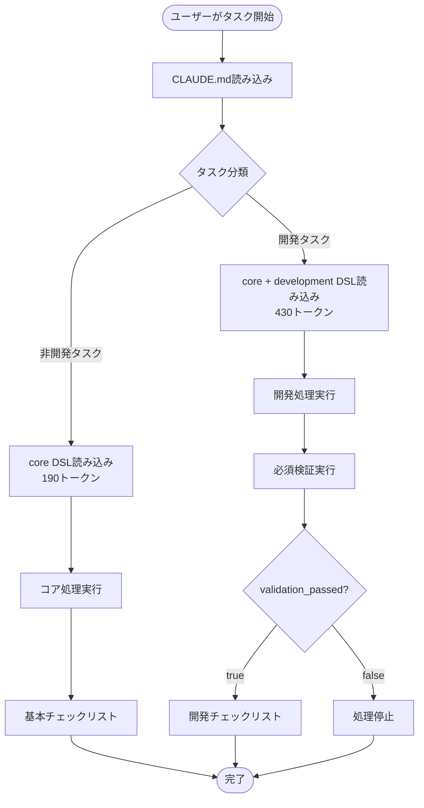
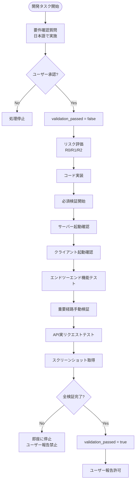
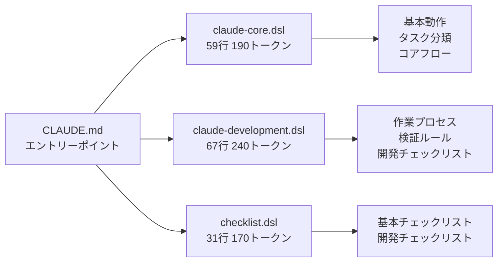
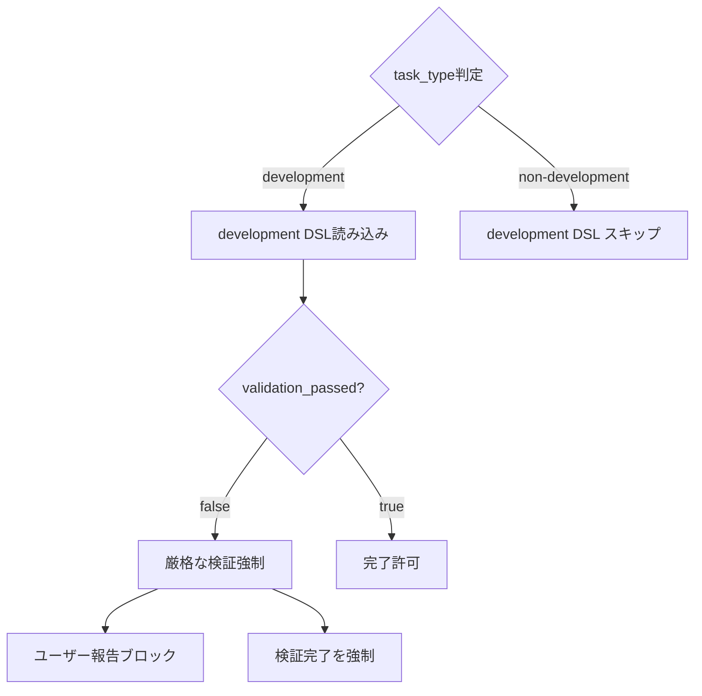
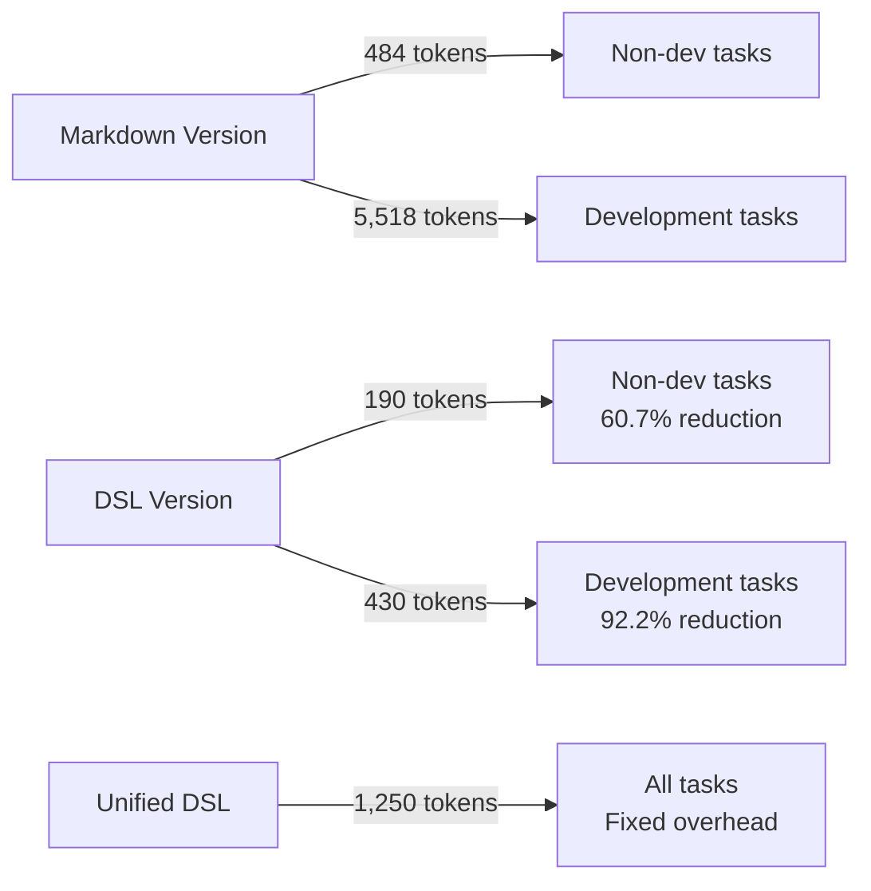
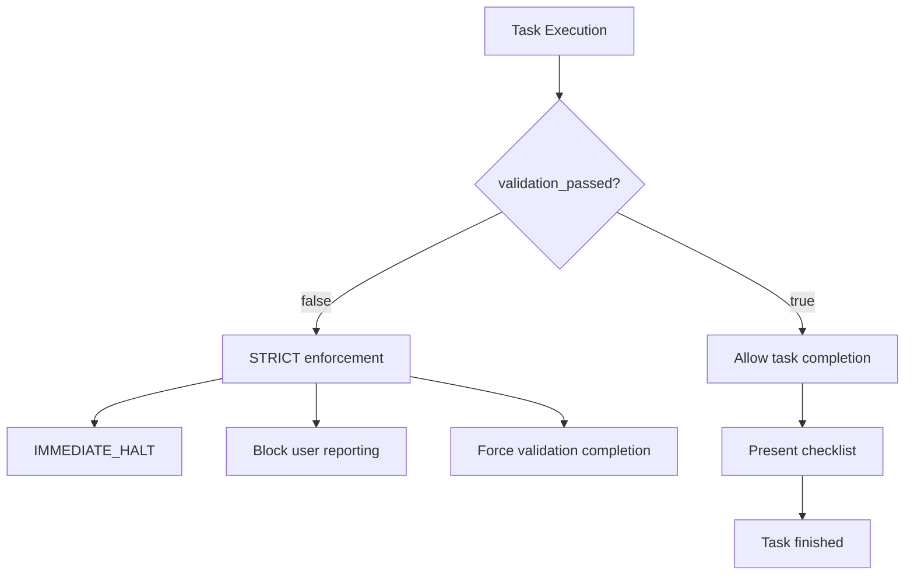

# Claude DSL Processing Flow

## 1. 全体フロー概要



## 2. 開発タスクの詳細フロー



## 3. DSLファイル構造と読み込み



## 4. 条件分岐ロジック



## 5. File Structure & Loading

```
CLAUDE.md (Entry Point)
├── claude-core.dsl (59 lines, ~190 tokens)
│   ├── Basic behaviors
│   ├── Task classification 
│   └── Core flow control
├── claude-development.dsl (67 lines, ~240 tokens)
│   ├── Work processes
│   ├── Validation rules
│   └── Development checklist
└── checklist.dsl (31 lines, ~170 tokens)
    ├── Basic checklist
    └── Development checklist
```

## 6. Token Efficiency Comparison



## 7. Conditional Loading Logic

```yaml
# Core DSL decides loading strategy
rules:
  - if: task_type == "development"
    then:
      include:
        - components.validation_rules
        - components.work_process  
        - components.validation
  - if: not validation_passed
    then:
      action: halt
      message: "Complete ALL validation requirements"
```

## 8. Enforcement Mechanisms



## Key Benefits of DSL Approach

1. **Conditional Loading**: Only load what's needed per task type
2. **Variable Control**: `validation_passed` enforces completion
3. **Modular Design**: Separate concerns across files
4. **Token Efficiency**: 92.2% reduction for development tasks
5. **Strict Enforcement**: No exceptions to validation rules
6. **Japanese Communication**: Built-in language requirements